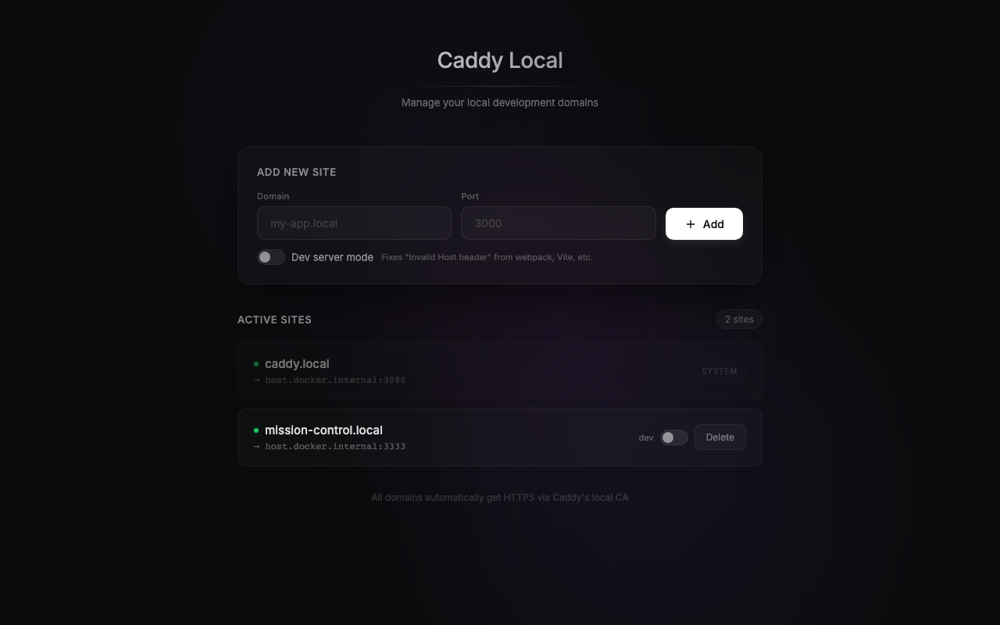

# Caddy Local

A web UI for managing local development domains with [Caddy](https://caddyserver.com/) reverse proxy.

Add `.local` domains that route to your dev servers running on specific ports — no manual Caddyfile editing or `/etc/hosts` management needed.



## Features

- Add/remove local domains via a simple web interface
- Automatic Caddyfile generation and hot-reload
- Dev server mode (rewrites Host header for frameworks that need it)
- Auto-sync managed domains to `/etc/hosts` via launchd

## Setup

```bash
# Install the hosts file sync daemon (macOS, one-time)
sudo ./install-sync.sh

# Start everything
docker compose up --build
```

The UI is available at [http://caddy.local](http://caddy.local) (or `http://localhost:3080`).

## Usage

1. Enter a domain name and the port your dev server is running on
2. Click **Add** — Caddy starts proxying `https://yourdomain.local` to `localhost:port`
3. Toggle **Dev Mode** if your framework requires the original Host header
